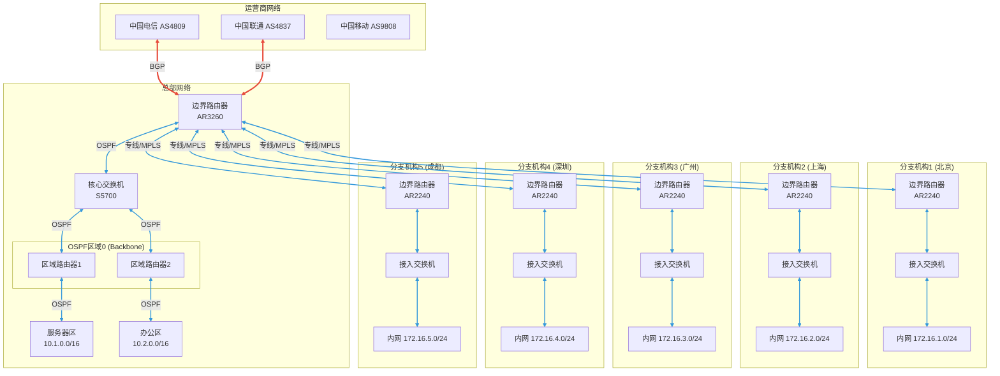

## 前言

"OSPF和BGP到底有什么区别？"

"企业网络里什么时候用OSPF，什么时候用BGP？"

"华为设备上OSPF和BGP怎么配置？"

刚踏入网络工程领域的前两年，我也在这些问题上纠结过。今天结合实际项目经验，跟大家聊聊OSPF和BGP在企业网络中的实际应用。

---

## 一、OSPF与BGP核心特点对比

### 1.1 一句话理解两个协议

```
┌─────────────────────────────────────────────────────────────────┐
│                    OSPF vs BGP 一句话总结                           │
├─────────────────────────────────────────────────────────────────┤
│                                                                 │
│   ┌─────────────────────────────────────────────────────────┐   │
│   │                                                         │   │
│   │   OSPF = 内部的"快路子"                               │   │
│   │   ├── 同一公司内部的导航                              │   │
│   │   ├── 找最短路径                                      │   │
│   │   └── 收敛快，配置简单                                │   │
│   │                                                         │   │
│   │   BGP = 跨公司的"高速路"                             │   │
│   │   ├── 不同公司之间的协议                              │   │
│   │   ├── 策略优先，不只看距离                            │   │
│   │   └── 稳定第一，慢速收敛                             │   │
│   │                                                         │   │
│   └─────────────────────────────────────────────────────────┘   │
│                                                                 │
└─────────────────────────────────────────────────────────────────┘
```

### 1.2 核心指标对比

```
┌─────────────────────────────────────────────────────────────────┐
│                    OSPF与BGP核心指标对比                            │
├─────────────────────────────────────────────────────────────────┤
│                                                                 │
│   ┌─────────────────────────────────────────────────────────┐   │
│   │   对比项          │       OSPF        │      BGP        │   │
│   ├─────────────────────────────────────────────────────────┤   │
│   │                                                         │   │
│   │   协议类型        │    链路状态       │    路径向量      │   │
│   │   ──────────────────────────────────────────────────────│   │
│   │   作用域          │   同一个AS内      │ 跨AS互联        │   │
│   │   ──────────────────────────────────────────────────────│   │
│   │   路由算法        │   SPF/Dijkstra   │   Path Vector  │   │
│   │   ──────────────────────────────────────────────────────│   │
│   │   路由数量        │   几十~几百条     │  数十万条       │   │
│   │   ──────────────────────────────────────────────────────│   │
│   │   收敛速度        │      快          │     慢         │   │
│   │   ──────────────────────────────────────────────────────│   │
│   │   开销计算        │   带宽/延迟      │    策略控制     │   │
│   │   ──────────────────────────────────────────────────────│   │
│   │   配置复杂度      │      低          │     高         │   │
│   │   ──────────────────────────────────────────────────────│   │
│   │   路由策略        │      弱          │     强         │   │
│   │   ──────────────────────────────────────────────────────│   │
│   │   适用场景        │   企业内部       │  运营商/多AS   │   │
│   │                                                         │   │
│   └─────────────────────────────────────────────────────────┘   │
│                                                                 │
└─────────────────────────────────────────────────────────────────┘
```

### 1.3 开销(Cost)计算方式

```
┌─────────────────────────────────────────────────────────────────┐
│                    开销计算对比                                    │
├─────────────────────────────────────────────────────────────────┤
│                                                                 │
│   ┌─────────────────────────────────────────────────────────┐   │
│   │              OSPF开销计算                                │   │
│   ├─────────────────────────────────────────────────────────┤   │
│   │                                                         │   │
│   │   OSPF开销 = 接口带宽的参考值 / 接口实际带宽            │   │
│   │                                                         │   │
│   │   默认参考带宽: 100Mbps                                 │   │
│   │                                                         │   │
│   │   ┌─────────────────────────────────────────────────┐   │   │
│   │   │                                                 │   │   │
│   │   │   接口类型      │  开销值                      │   │   │
│   │   │   ─────────────────────────────────────────────│   │   │
│   │   │   GigabitEthernet  │  1                    │   │   │
│   │   │   FastEthernet      │  1 (100Mbps)          │   │   │
│   │   │   Serial (E1)       │  48 或 64             │   │   │
│   │   │   10GE              │  1 (10Gbps > 100Mbps) │   │   │
│   │   │   Loopback          │  0 (最优先)            │   │   │
│   │   │                                                 │   │   │
│   │   └─────────────────────────────────────────────────┘   │   │
│   │                                                         │   │
│   │   计算示例:                                            │   │
│   │   路径: PC -- FE(100M) -- Switch -- GE(1G) -- Router │   │
│   │   总开销: 1 + 1 = 2 (取带宽最小的接口)                │   │
│   │                                                         │   │
│   └─────────────────────────────────────────────────────────┘   │
│                                                                 │
│   ┌─────────────────────────────────────────────────────────┐   │
│   │              BGP开销计算 (实际上是策略)                   │   │
│   ├─────────────────────────────────────────────────────────┤   │
│   │                                                         │   │
│   │   BGP不看"距离"，看"策略"                             │   │
│   │                                                         │   │
│   │   ┌─────────────────────────────────────────────────┐   │   │
│   │   │                                                 │   │   │
│   │   │   BGP选路不看链路带宽，看:                       │   │   │
│   │   │                                                 │   │   │
│   │   │   1. AS_PATH长度 (经过几个公司)                 │   │   │
│   │   │   2. LOCAL_PREF (自己想走哪)                     │   │   │
│   │   │   3. MED (告诉别人自己想怎么进)                  │   │   │
│   │   │   4. 路由来源 (自己宣告的优先)                   │   │   │
│   │   │                                                 │   │   │
│   │   └─────────────────────────────────────────────────┘   │   │
│   │                                                         │   │
│   │   示例:                                               │   │
│   │   走电信: AS_PATH = 4809, 4837, 你的AS             │   │
│   │   走联通: AS_PATH = 4837, 4809, 你的AS             │   │
│   │   AS_PATH短的那条优先！                               │   │
│   │                                                         │   │
│   └─────────────────────────────────────────────────────────┘   │
│                                                                 │
└─────────────────────────────────────────────────────────────────┘
```

### 1.4 收敛速度对比

```
┌─────────────────────────────────────────────────────────────────┐
│                    收敛速度对比                                    │
├─────────────────────────────────────────────────────────────────┤
│                                                                 │
│   ┌─────────────────────────────────────────────────────────┐   │
│   │              OSPF收敛过程                                │   │
│   ├─────────────────────────────────────────────────────────┤   │
│   │                                                         │   │
│   │   链路变化 → 触发LSA泛洪 → 重新计算SPF → 新路由生效  │   │
│   │       │              │              │               │       │   │
│   │       ▼              ▼              ▼               ▼       │   │
│   │     毫秒级        毫秒~秒        毫秒~秒         秒级     │   │
│   │                                                         │   │
│   │   总收敛时间: 通常几秒内完成                          │   │
│   │                                                         │   │
│   └─────────────────────────────────────────────────────────┘   │
│                                                                 │
│   ┌─────────────────────────────────────────────────────────┐   │
│   │              BGP收敛过程                                │   │
│   ├─────────────────────────────────────────────────────────┤   │
│   │                                                         │   │
│   │   路由变化 → 检测(holdtime) → 发送UPDATE → 新路由生效 │   │
│   │       │           │(默认180s)       │               │       │   │
│   │       ▼           ▼                 ▼               ▼       │   │
│   │     秒级       秒~分钟          秒级           分钟级     │   │
│   │                                                         │   │
│   │   总收敛时间: 可能需要几分钟                           │   │
│   │                                                         │   │
│   │   ⚠️ 为什么BGP收敛慢？                               │   │
│   │   ├── 互联网路由量太大(数十万条)                      │   │
│   │   ├── 稳定第一，抑制频繁变化                          │   │
│   │   └── 快速收敛可能引发路由震荡                        │   │
│   │                                                         │   │
│   └─────────────────────────────────────────────────────────┘   │
│                                                                 │
└─────────────────────────────────────────────────────────────────┘
```

---

## 二、典型部署场景

### 2.1 企业网络分层架构

```
┌─────────────────────────────────────────────────────────────────┐
│                    企业网络分层模型                                │
├─────────────────────────────────────────────────────────────────┤
│                                                                 │
│   ┌─────────────────────────────────────────────────────────┐   │
│   │                                                         │   │
│   │                 运营商骨干网络                          │   │
│   │                      (BGP)                              │   │
│   │                         ▲                               │   │
│   │                         │                               │   │
│   │                         │ BGP                          │   │
│   │                         │                               │   │
│   │   ┌─────────────────────┴─────────────────────┐       │   │
│   │   │                                             │       │   │
│   │   │          企业边界 (出口路由器)              │       │   │
│   │   │            CORE-Router                    │       │   │
│   │   │                  │                         │       │   │
│   │   │                  │ OSPF                    │       │   │
│   │   │                  │                         │       │   │
│   │   └──────────────────┼─────────────────────────┘       │   │
│   │                      │                                  │   │
│   │           ┌──────────┼──────────┐                     │   │
│   │           │          │          │                      │   │
│   │           ▼          ▼          ▼                      │   │
│   │       ┌─────┐  ┌─────┐  ┌─────┐                   │   │
│   │       │区域1 │  │区域0 │  │区域2 │                   │   │
│   │       │OSPF │  │ OSPF │  │ OSPF │                   │   │
│   │       └─────┘  └─────┘  └─────┘                   │   │
│   │                                                         │   │
│   │   ┌─────────────────────────────────────────────────┐   │   │
│   │   │                                                 │   │   │
│   │   │   总结:                                          │   │   │
│   │   │   ├── 企业内部: OSPF (快、简单)                  │   │   │
│   │   │   └── 企业边界/跨运营商: BGP (策略、互联)        │   │   │
│   │   │                                                 │   │   │
│   │   └─────────────────────────────────────────────────┘   │   │
│   │                                                         │   │
│   └─────────────────────────────────────────────────────────┘   │
│                                                                 │
└─────────────────────────────────────────────────────────────────┘
```

### 2.2 园区网内部: OSPF

```
┌─────────────────────────────────────────────────────────────────┐
│                    园区网OSPF部署场景                             │
├─────────────────────────────────────────────────────────────────┤
│                                                                 │
│   ┌─────────────────────────────────────────────────────────┐   │
│   │                                                         │   │
│   │   为什么园区网用OSPF?                                 │   │
│   │                                                         │   │
│   │   ┌─────────────────────────────────────────────────┐   │   │
│   │   │                                                 │   │   │
│   │   │   1. 路由数量少 (几十~几百条)                   │   │   │
│   │   │      └── BGP来处理这么少路由太浪费              │   │   │
│   │   │                                                 │   │   │
│   │   │   2. 收敛要快                                   │   │   │
│   │   │      └── 办公网络断了要秒级恢复                 │   │   │
│   │   │                                                 │   │   │
│   │   │   3. 配置简单                                   │   │   │
│   │   │      └── 几行命令就能跑起来                    │   │   │
│   │   │                                                 │   │   │
│   │   │   4. 天然支持多区域                             │   │   │
│   │   │      └── 大楼之间、楼层之间可以划区域          │   │   │
│   │   │                                                 │   │   │
│   │   └─────────────────────────────────────────────────┘   │   │
│   │                                                         │   │
│   └─────────────────────────────────────────────────────────┘   │
│                                                                 │
│   ┌─────────────────────────────────────────────────────────┐   │
│   │              典型园区网OSPF区域划分                      │   │
│   ├─────────────────────────────────────────────────────────┤   │
│   │                                                         │   │
│   │           ┌──────────────────────────────────┐       │   │
│   │           │        区域0 (Backbone)          │       │   │
│   │           │                                  │       │   │
│   │           │    ┌────────┐   ┌────────┐     │       │   │
│   │           │    │Core/RR│───│Core/RR│     │       │   │
│   │           │    └───┬────┘   └────┬───┘     │       │   │
│   │           └────────┼────────────┼──────────┘       │   │
│   │                    │            │                   │   │
│   │        ┌───────────┼────────────┼───────────┐      │   │
│   │        │           │            │           │      │   │
│   │        ▼           ▼            ▼           ▼      │   │
│   │    ┌──────┐   ┌──────┐   ┌──────┐   ┌──────┐   │   │
│   │    │区域10 │   │区域20 │   │区域30 │   │区域40 │   │   │
│   │    │研发楼 │   │办公楼 │   │生产楼 │   │IDC   │   │   │
│   │    └──────┘   └──────┘   └──────┘   └──────┘   │   │
│   │                                                         │   │
│   └─────────────────────────────────────────────────────────┘   │
│                                                                 │
└─────────────────────────────────────────────────────────────────┘
```

### 2.3 跨地区互联: BGP

```
┌─────────────────────────────────────────────────────────────────┐
│                    跨地区BGP部署场景                               │
├─────────────────────────────────────────────────────────────────┤
│                                                                 │
│   ┌─────────────────────────────────────────────────────────┐   │
│   │                                                         │   │
│   │   为什么分支机构互联用BGP?                             │   │
│   │                                                         │   │
│   │   ┌─────────────────────────────────────────────────┐   │   │
│   │   │                                                 │   │   │
│   │   │   1. 多运营商接入                               │   │   │
│   │   │      └── 需要策略选路(走电信还是联通)           │   │   │
│   │   │                                                 │   │   │
│   │   │   2. 路由策略复杂                               │   │   │
│   │   │      └── 某些流量要走专线，某些走互联网         │   │   │
│   │   │                                                 │   │   │
│   │   │   3. 需要宣告自己给上游                         │   │   │
│   │   │      └── 分支机构的网段要能被总部访问          │   │   │
│   │   │                                                 │   │   │
│   │   │   4. 和运营商对接                               │   │   │
│   │   │      └── BGP是对接运营商的标准协议             │   │   │
│   │   │                                                 │   │   │
│   │   └─────────────────────────────────────────────────┘   │   │
│   │                                                         │   │
│   └─────────────────────────────────────────────────────────┘   │
│                                                                 │
└─────────────────────────────────────────────────────────────────┘
```

---

## 三、企业网络拓扑图

### 3.1 Mermaid拓扑图



### 3.2 拓扑说明

```
┌─────────────────────────────────────────────────────────────────┐
│                    网络架构说明                                   │
├─────────────────────────────────────────────────────────────────┤
│                                                                 │
│   ┌─────────────────────────────────────────────────────────┐   │
│   │              设备选型建议                                │   │
│   ├─────────────────────────────────────────────────────────┤   │
│   │                                                         │   │
│   │   总部边界路由器: 华为AR3260/AR2240                     │   │
│   │   ├── 需要支持BGP、足够NAT性能                         │   │
│   │   └── 多运营商接入                                      │   │
│   │                                                         │   │
│   │   总部核心交换机: 华为S5700/S6700                      │   │
│   │   ├── 需要支持OSPF多实例                                │   │
│   │   └── 二三层转发                                        │   │
│   │                                                         │   │
│   │   分支边界路由器: 华为AR2240/AR1220                     │   │
│   │   ├── 支持BGP + OSPF                                   │   │
│   │   └── 专线/VPN接入                                    │   │
│   │                                                         │   │
│   │   分支接入交换机: 华为S2700/S3700                      │   │
│   │   └── 二层交换即可                                      │   │
│   │                                                         │   │
│   └─────────────────────────────────────────────────────────┘   │
│                                                                 │
│   ┌─────────────────────────────────────────────────────────┐   │
│   │              IP规划                                      │   │
│   ├─────────────────────────────────────────────────────────┤   │
│   │                                                         │   │
│   │   总部:                                                 │   │
│   │   ├── 服务器区: 10.1.0.0/16                           │   │
│   │   ├── 办公区: 10.2.0.0/16                           │   │
│   │   └── 管理VLAN: 10.0.0.0/24                          │   │
│   │                                                         │   │
│   │   分支机构:                                             │   │
│   │   ├── 北京: 172.16.1.0/24                           │   │
│   │   ├── 上海: 172.16.2.0/24                           │   │
│   │   ├── 广州: 172.16.3.0/24                           │   │
│   │   ├── 深圳: 172.16.4.0/24                           │   │
│   │   └── 成都: 172.16.5.0/24                           │   │
│   │                                                         │   │
│   │   互联地址:                                             │   │
│   │   └── 总部-分支: 192.168.1.0/30 ~ 192.168.5.0/30   │   │
│   │                                                         │   │
│   └─────────────────────────────────────────────────────────┘   │
│                                                                 │
│   ┌─────────────────────────────────────────────────────────┐   │
│   │              路由协议规划                                │   │
│   ├─────────────────────────────────────────────────────────┤   │
│   │                                                         │   │
│   │   总部内部: OSPF Area 0                                │   │
│   │   ├── 核心交换机、接入交换机之间跑OSPF                │   │
│   │   └── 区域0 (Backbone)                                 │   │
│   │                                                         │   │
│   │   总部边界: BGP AS 65001                              │   │
│   │   ├── 与电信、联通建立EBGP邻居                        │   │
│   │   └── 宣告总部和分支网段                              │   │
│   │                                                         │   │
│   │   分支机构:                                             │   │
│   │   ├── BGP与总部建立EBGP邻居                           │   │
│   │   └── OSPF做内网路由                                  │   │
│   │                                                         │   │
│   └─────────────────────────────────────────────────────────┘   │
│                                                                 │
└─────────────────────────────────────────────────────────────────┘
```

---

## 四、选路策略详解

### 4.1 为什么需要选路策略

```
┌─────────────────────────────────────────────────────────────────┐
│                    选路策略的必要性                               │
├─────────────────────────────────────────────────────────────────┤
│                                                                 │
│   ┌─────────────────────────────────────────────────────────┐   │
│   │                                                         │   │
│   │   问题: 如果没有选路策略，会怎样？                      │   │
│   │                                                         │   │
│   │   ┌─────────────────────────────────────────────────┐   │   │
│   │   │                                                 │   │   │
│   │   │          电信 ──→ 总部 ──→ 分支               │   │   │
│   │   │           │              ↑                      │   │   │
│   │   │           │              │                      │   │   │
│   │   │           └────── 绕路? ─┘                      │   │   │
│   │   │                                                 │   │   │
│   │   │   现象:                                         │   │   │
│   │   │   ├── 移动用户访问服务器，绕到电信再回来        │   │   │
│   │   │   ├── 延迟翻倍，体验差                          │   │   │
│   │   │   └── 浪费带宽资源                              │   │   │
│   │   │                                                 │   │   │
│   │   └─────────────────────────────────────────────────┘   │   │
│   │                                                         │   │
│   └─────────────────────────────────────────────────────────┘   │
│                                                                 │
│   ┌─────────────────────────────────────────────────────────┐   │
│   │                                                         │   │
│   │   解决方案: 配置选路策略                               │   │
│   │                                                         │   │
│   │   ┌─────────────────────────────────────────────────┐   │   │
│   │   │                                                 │   │   │
│   │   │   电信用户 ──走电信──▶ 服务器                   │   │   │
│   │   │                                                 │   │   │
│   │   │   联通用户 ──走联通──▶ 服务器                   │   │   │
│   │   │                                                 │   │   │
│   │   │   移动用户 ──走移动──▶ 服务器                   │   │   │
│   │   │                                                 │   │   │
│   │   │   效果: 最短路径，用户体验好                    │   │   │
│   │   │                                                 │   │   │
│   │   └─────────────────────────────────────────────────┘   │   │
│   │                                                         │   │
│   └─────────────────────────────────────────────────────────┘   │
│                                                                 │
└─────────────────────────────────────────────────────────────────┘
```

### 4.2 BGP选路策略

```
┌─────────────────────────────────────────────────────────────────┐
│                    BGP选路策略详解                                │
├─────────────────────────────────────────────────────────────────┤
│                                                                 │
│   ┌─────────────────────────────────────────────────────────┐   │
│   │              策略1: LOCAL_PREF (本地优先级)               │   │
│   ├─────────────────────────────────────────────────────────┤   │
│   │                                                         │   │
│   │   作用: 告诉AS内部"我想从哪个口子出去"                  │   │
│   │                                                         │   │
│   │   场景: 总部有电信和联通两条线路                       │   │
│   │   目标: 所有访问分支的流量优先走联通                   │   │
│   │                                                         │   │
│   │   配置思路:                                            │   │
│   │   ┌─────────────────────────────────────────────────┐   │   │
│   │   │                                                 │   │   │
│   │   │   # 1. 创建策略                                 │   │   │
│   │   │   route-policy LOC_PREF permit node 10          │   │   │
│   │   │     apply local-preference 200                   │   │   │
│   │   │                                                 │   │   │
│   │   │   # 2. 应用到从联通学来的路由                     │   │   │
│   │   │   bgp 65001                                      │   │   │
│   │   │     peer 10.1.1.2 route-policy LOC_PREF import  │   │   │
│   │   │                                                 │   │   │
│   │   │   # 效果: 从联通学来的路由LOCAL_PREF=200        │   │   │
│   │   │   #        从电信学来的路由LOCAL_PREF=100(默认) │   │   │
│   │   │   #        BGP优先选择LOCAL_PREF=200的路由      │   │   │
│   │   │                                                 │   │   │
│   │   └─────────────────────────────────────────────────┘   │   │
│   │                                                         │   │
│   └─────────────────────────────────────────────────────────┘   │
│                                                                 │
│   ┌─────────────────────────────────────────────────────────┐   │
│   │              策略2: AS_PATH (路径长度)                    │   │
│   ├─────────────────────────────────────────────────────────┤   │
│   │                                                         │   │
│   │   作用: AS路径越短，越优先                              │   │
│   │                                                         │   │
│   │   场景:                                                  │   │
│   │   ├── 走电信: AS_PATH = 4809, 4837, 65002 (2个AS)  │   │
│   │   └── 走联通: AS_PATH = 4837, 65002 (1个AS)         │   │
│   │                                                         │   │
│   │   结果: 优先走联通 (AS_PATH更短)                       │   │
│   │                                                         │   │
│   │   也可以手动增加AS_PATH来"故意绕路":                   │   │
│   │   ┌─────────────────────────────────────────────────┐   │   │
│   │   │                                                 │   │   │
│   │   │   # 让电信的路由看起来更长                       │   │   │
│   │   │   route-policy AS_PATH permit node 10           │   │   │
│   │   │     apply as-path-path 65001 65001 additive     │   │   │
│   │   │                                                 │   │   │
│   │   │   # 应用到发给电信的路由                         │   │   │
│   │   │   bgp 65001                                      │   │   │
│   │   │     peer 10.1.1.2 route-policy AS_PATH export   │   │   │
│   │   │                                                 │   │   │
│   │   │   # 效果: 原本 AS_PATH = 65001                 │   │   │
│   │   │   #        变成 AS_PATH = 65001 65001 65001    │   │   │
│   │   │   #        更长，其他AS会优先选择别的路        │   │   │
│   │   │                                                 │   │   │
│   │   └─────────────────────────────────────────────────┘   │   │
│   │                                                         │   │
│   └─────────────────────────────────────────────────────────┘   │
│                                                                 │
│   ┌─────────────────────────────────────────────────────────┐   │
│   │              策略3: MED (多出口鉴别器)                    │   │
│   ├─────────────────────────────────────────────────────────┤   │
│   │                                                         │   │
│   │   作用: 告诉其他AS"你从哪个口子进我最优"               │   │
│   │                                                         │   │
│   │   场景:                                                  │   │
│   │   电信用户访问你的服务器，告诉电信"从上海入口更快"      │   │
│   │                                                         │   │
│   │   配置:                                                  │   │
│   │   ┌─────────────────────────────────────────────────┐   │   │
│   │   │                                                 │   │   │
│   │   │   route-policy MED permit node 10               │   │   │
│   │   │     apply med 100                               │   │   │
│   │   │                                                 │   │   │
│   │   │   bgp 65001                                      │   │   │
│   │   │     peer 10.1.1.2 route-policy MED export       │   │   │
│   │   │                                                 │   │   │
│   │   └─────────────────────────────────────────────────┘   │   │
│   │                                                         │   │
│   └─────────────────────────────────────────────────────────┘   │
│                                                                 │
└─────────────────────────────────────────────────────────────────┘
```

### 4.3 OSPF选路策略

```
┌─────────────────────────────────────────────────────────────────┐
│                    OSPF选路策略详解                                │
├─────────────────────────────────────────────────────────────────┤
│                                                                 │
│   ┌─────────────────────────────────────────────────────────┐   │
│   │              策略1: 接口开销 (Cost)                      │   │
│   ├─────────────────────────────────────────────────────────┤   │
│   │                                                         │   │
│   │   OSPF通过Cost值选路，值越小越优先                      │   │
│   │                                                         │   │
│   │   调整方法:                                            │   │
│   │   ┌─────────────────────────────────────────────────┐   │   │
│   │   │                                                 │   │   │
│   │   │   # 方法1: 在接口下配置                         │   │   │
│   │   │   interface GigabitEthernet0/0/1                 │   │   │
│   │   │     ospf cost 10                                │   │   │
│   │   │                                                 │   │   │
│   │   │   # 方法2: 修改默认参考带宽                     │   │   │
│   │   │   ospf 1                                        │   │   │
│   │   │     bandwidth-reference 1000                    │   │   │
│   │   │     # 把参考带宽从100M改成1000M                 │   │   │
│   │   │     # 10GE接口开销 = 1000/10000 = 1            │   │   │
│   │   │                                                 │   │   │
│   │   └─────────────────────────────────────────────────┘   │   │
│   │                                                         │   │
│   │   开销计算:                                            │   │
│   │   路径总Cost = 沿途所有出接口Cost之和                  │   │
│   │                                                         │   │
│   └─────────────────────────────────────────────────────────┘   │
│                                                                 │
│   ┌─────────────────────────────────────────────────────────┐   │
│   │              策略2: 路由引入 (import)                     │   │
│   ├─────────────────────────────────────────────────────────┤   │
│   │                                                         │   │
│   │   场景: OSPF需要引入其他协议的路由                      │   │
│   │                                                         │   │
│   │   ┌─────────────────────────────────────────────────┐   │   │
│   │   │                                                 │   │   │
│   │   │   # 引入静态路由，并设置开销                    │   │   │
│   │   │   ospf 1                                        │   │   │
│   │   │     import-route static cost 20                  │   │   │
│   │   │                                                 │   │   │
│   │   │   # 引入BGP路由，并设置开销                    │   │   │
│   │   │   ospf 1                                        │   │   │
│   │   │     import-route bgp cost 30 type 1            │   │   │
│   │   │                                                 │   │   │
│   │   └─────────────────────────────────────────────────┘   │   │
│   │                                                         │   │
│   └─────────────────────────────────────────────────────────┘   │
│                                                                 │
│   ┌─────────────────────────────────────────────────────────┐   │
│   │              策略3: 路由聚合 (abr-summary)               │   │
│   ├─────────────────────────────────────────────────────────┤   │
│   │                                                         │   │
│   │   场景: 减少区域间路由数量，简化拓扑                   │   │
│   │                                                         │   │
│   │   ┌─────────────────────────────────────────────────┐   │   │
│   │   │                                                 │   │   │
│   │   │   # 在ABR上聚合路由                            │   │   │
│   │   │   ospf 1                                        │   │   │
│   │   │     area 0.0.0.10                              │   │   │
│   │   │       abr-summary 10.1.0.0 255.255.0.0        │   │   │
│   │   │                                                 │   │   │
│   │   │   # 效果:                                      │   │   │
│   │   │   # 原来是: 10.1.1.0/24, 10.1.2.0/24...      │   │   │
│   │   │   # 汇总为: 10.1.0.0/16                       │   │   │
│   │   │                                                 │   │   │
│   │   └─────────────────────────────────────────────────┘   │   │
│   │                                                         │   │
│   └─────────────────────────────────────────────────────────┘   │
│                                                                 │
└─────────────────────────────────────────────────────────────────┘
```

---

## 五、华为设备配置示例

### 5.1 OSPF配置示例

```
┌─────────────────────────────────────────────────────────────────┐
│                    华为设备OSPF配置示例                           │
├─────────────────────────────────────────────────────────────────┤
│                                                                 │
│   ┌─────────────────────────────────────────────────────────┐   │
│   │              总部核心交换机OSPF配置                       │   │
│   ├─────────────────────────────────────────────────────────┤   │
│   │                                                         │   │
│   │   <HUAWEI> system-view                               │   │
│   │   [HUAWEI] sysname Core-SW                           │   │
│   │                                                         │   │
│   │   # 1. 启用OSPF，并设置Router-ID                      │   │
│   │   [Core-SW] ospf 1 router-id 10.0.0.1               │   │
│   │                                                         │   │
│   │   # 2. 配置区域0 (Backbone)                          │   │
│   │   [Core-SW-ospf-1] area 0.0.0.0                      │   │
│   │                                                         │   │
│   │   # 3. 宣告直连接口 (网段)                           │   │
│   │   [Core-SW-ospf-1-area-0.0.0.0] network 10.0.0.0 0.0.0.255 │   │
│   │   [Core-SW-ospf-1-area-0.0.0.0] network 10.1.0.0 0.0.255.255 │   │
│   │   [Core-SW-ospf-1-area-0.0.0.0] network 10.2.0.0 0.0.255.255 │   │
│   │                                                         │   │
│   │   # 4. (可选) 修改OSPF参考带宽                       │   │
│   │   [Core-SW-ospf-1] bandwidth-reference 1000           │   │
│   │                                                         │   │
│   │   # 5. (可选) 引入默认路由                            │   │
│   │   [Core-SW-ospf-1] default-route-advertise always    │   │
│   │                                                         │   │
│   │   [Core-SW-ospf-1] quit                              │   │
│   │                                                         │   │
│   │   # 6. 配置静默接口 (不收发OSPF报文)                  │   │
│   │   [Core-SW] interface GigabitEthernet0/0/3           │   │
│   │   [Core-SW-GigabitEthernet0/0/3] ospf enable 1 area 0.0.0.0 │   │
│   │   [Core-SW-GigabitEthernet0/0/3] ospf network-type p2p │   │
│   │   [Core-SW-GigabitEthernet0/0/3] quit                │   │
│   │                                                         │   │
│   └─────────────────────────────────────────────────────────┘   │
│                                                                 │
│   ┌─────────────────────────────────────────────────────────┐   │
│   │              OSPF常用查看命令                           │   │
│   ├─────────────────────────────────────────────────────────┤   │
│   │                                                         │   │
│   │   <Core-SW> display ospf peer                        │   │
│   │       # 查看OSPF邻居状态                               │   │
│   │                                                         │   │
│   │   <Core-SW> display ospf routing                     │   │
│   │       # 查看OSPF路由表                                 │   │
│   │                                                         │   │
│   │   <Core-SW> display ospf lsdb                        │   │
│   │       # 查看OSPF链路状态数据库                        │   │
│   │                                                         │   │
│   │   <Core-SW> display ospf interface                  │   │
│   │       # 查看OSPF接口配置                               │   │
│   │                                                         │   │
│   └─────────────────────────────────────────────────────────┘   │
│                                                                 │
└─────────────────────────────────────────────────────────────────┘
```

### 5.2 BGP配置示例

```
┌─────────────────────────────────────────────────────────────────┐
│                    华为设备BGP配置示例                           │
├─────────────────────────────────────────────────────────────────┤
│                                                                 │
│   ┌─────────────────────────────────────────────────────────┐   │
│   │              边界路由器BGP配置 (总部)                     │   │
│   ├─────────────────────────────────────────────────────────┤   │
│   │                                                         │   │
│   │   <HUAWEI> system-view                               │   │
│   │   [HUAWEI] sysname Border-Router                     │   │
│   │                                                         │   │
│   │   # 1. 启用BGP，指定AS号                              │   │
│   │   [Border-Router] bgp 65001                          │   │
│   │                                                         │   │
│   │   # 2. 配置Router-ID                                 │   │
│   │   [Border-Router-bgp] router-id 10.0.0.254          │   │
│   │                                                         │   │
│   │   # 3. 宣告自己的网段 (OSPF域内的网段)                 │   │
│   │   [Border-Router-bgp] import-route ospf 1            │   │
│   │   [Border-Router-bgp] # 或者用network方式:            │   │
│   │   [Border-Router-bgp] network 10.0.0.0 255.0.0.0    │   │
│   │   [Border-Router-bgp] network 172.16.0.0 255.255.0.0 │   │
│   │                                                         │   │
│   │   # 4. 配置与电信的EBGP邻居                           │   │
│   │   [Border-Router-bgp] peer 202.96.1.1 as-number 4809 │   │
│   │   [Border-Router-bgp] peer 202.96.1.1 description Telecom │   │
│   │   [Border-Router-bgp] peer 202.96.1.1 password simple Telecom@123 │   │
│   │                                                         │   │
│   │   # 5. 配置与联通的EBGP邻居                           │   │
│   │   [Border-Router-bgp] peer 218.2.1.1 as-number 4837 │   │
│   │   [Border-Router-bgp] peer 218.2.1.1 description ChinaUnicom │   │
│   │   [Border-Router-bgp] peer 218.2.1.1 password simple Unicom@123 │   │
│   │                                                         │   │
│   │   # 6. (可选) 配置MED，让运营商知道你希望怎么走      │   │
│   │   [Border-Router-bgp] peer 202.96.1.1 route-policy MED export │   │
│   │   [Border-Router-bgp] peer 218.2.1.1 route-policy MED export │   │
│   │                                                         │   │
│   │   # 7. (可选) 允许向邻居发送默认路由                  │   │
│   │   [Border-Router-bgp] peer 202.96.1.1 default-route-advertise │   │
│   │   [Border-Router-bgp] peer 218.2.1.1 default-route-advertise │   │
│   │                                                         │   │
│   │   [Border-Router-bgp] quit                            │   │
│   │                                                         │   │
│   └─────────────────────────────────────────────────────────┘   │
│                                                                 │
│   ┌─────────────────────────────────────────────────────────┐   │
│   │              分支机构BGP配置                              │   │
│   ├─────────────────────────────────────────────────────────┤   │
│   │                                                         │   │
│   │   <HUAWEI> system-view                               │   │
│   │   [HUAWEI] sysname Branch-Router                      │   │
│   │                                                         │   │
│   │   # 1. 启用BGP                                        │   │
│   │   [Branch-Router] bgp 65002                          │   │
│   │   [Branch-Router-bgp] router-id 172.16.1.254         │   │
│   │                                                         │   │
│   │   # 2. 宣告分支内网网段                               │   │
│   │   [Branch-Router-bgp] network 172.16.1.0 255.255.255.0 │   │
│   │                                                         │   │
│   │   # 3. 配置与总部的EBGP邻居                           │   │
│   │   [Branch-Router-bgp] peer 192.168.1.1 as-number 65001 │   │
│   │   [Branch-Router-bgp] peer 192.168.1.1 description HQ │   │
│   │                                                         │   │
│   │   # 4. 配置定时器 (可选，调整收敛速度)                │   │
│   │   [Branch-Router-bgp] peer 192.168.1.1 timer keepalive 30 hold 90 │   │
│   │                                                         │   │
│   │   [Branch-Router-bgp] quit                            │   │
│   │                                                         │   │
│   └─────────────────────────────────────────────────────────┘   │
│                                                                 │
│   ┌─────────────────────────────────────────────────────────┐   │
│   │              BGP常用查看命令                            │   │
│   ├─────────────────────────────────────────────────────────┤   │
│   │                                                         │   │
│   │   <Border-Router> display bgp peer                     │   │
│   │       # 查看BGP邻居状态                               │   │
│   │                                                         │   │
│   │   <Border-Router> display bgp routing-table          │   │
│   │       # 查看BGP路由表                                 │   │
│   │                                                         │   │
│   │   <Border-Router> display bgp routing-table 10.1.1.0 255.255.255.0 │   │
│   │       # 查看特定路由的详细信息                         │   │
│   │                                                         │   │
│   │   <Border-Router> display bgp routing-table as-path-regular-expression ^4809_   │   │
│   │       # 按AS_PATH过滤路由                             │   │
│   │                                                         │   │
│   └─────────────────────────────────────────────────────────┘   │
│                                                                 │
└─────────────────────────────────────────────────────────────────┘
```

### 5.3 完整配置示例

```
┌─────────────────────────────────────────────────────────────────┐
│                    完整配置示例: 总部边界路由器                    │
├─────────────────────────────────────────────────────────────────┤
│                                                                 │
│   # ------------------------------------------------------------ #
│   # 华为AR3260 边界路由器完整配置                                #
│   # 场景: 双运营商接入，企业AS 65001                           #
│   # ------------------------------------------------------------ #
│                                                                 │
│   <HUAWEI> system-view                                       │
│   [HUAWEI] sysname HQ-Border-Router                          │
│                                                                 │
│   # ------------------------------------------------------------ #
│   # 第一部分: 接口IP地址配置                                      #
│   # ------------------------------------------------------------ #
│                                                                 │
│   # 连接电信
│   [HQ-Border-Router] interface GigabitEthernet0/0/0         │
│   [HQ-Border-Router-GigabitEthernet0/0/0] ip address 202.96.1.2 255.255.255.252 │   │
│   [HQ-Border-Router-GigabitEthernet0/0/0] quit               │
│                                                                 │
│   # 连接联通
│   [HQ-Border-Router] interface GigabitEthernet0/0/1         │
│   [HQ-Border-Router-GigabitEthernet0/0/1] ip address 218.2.1.2 255.255.255.252 │   │
│   [HQ-Border-Router-GigabitEthernet0/0/1] quit               │
│                                                                 │
│   # 连接内网
│   [HQ-Border-Router] interface GigabitEthernet0/0/2         │
│   [HQ-Border-Router-GigabitEthernet0/0/2] ip address 10.0.0.254 255.255.255.0 │   │
│   [HQ-Border-Router-GigabitEthernet0/0/2] quit               │
│                                                                 │
│   # ------------------------------------------------------------ #
│   # 第二部分: OSPF配置 (与内网交换机对接)                        #
│   # ------------------------------------------------------------ #
│                                                                 │
│   [HQ-Border-Router] ospf 1 router-id 10.0.0.254             │
│   [HQ-Border-Router-ospf-1] area 0.0.0.0                   │
│   [HQ-Border-Router-ospf-1-area-0.0.0.0] network 10.0.0.0 0.0.0.255 │   │
│   [HQ-Border-Router-ospf-1-area-0.0.0.0] quit               │
│   [HQ-Border-Router-ospf-1] quit                             │
│                                                                 │
│   # ------------------------------------------------------------ #
│   # 第三部分: BGP配置 (与运营商对接)                             #
│   # ------------------------------------------------------------ #
│                                                                 │
│   [HQ-Border-Router] bgp 65001                                │
│   [HQ-Border-Router-bgp] router-id 10.0.0.254                │
│                                                                 │
│   # 配置与电信的EBGP邻居
│   [HQ-Border-Router-bgp] peer 202.96.1.1 as-number 4809    │
│   [HQ-Border-Router-bgp] peer 202.96.1.1 description ISP-Telecom │   │
│   [HQ-Border-Router-bgp] peer 202.96.1.1 password cipher $1a$2b$3c$4d$5e$6f$7g$8h$9i$0j$0k$1l$2m$3n$4o$5p$6q$7r │   │
│   [HQ-Border-Router-bgp] peer 202.96.1.1 timer keepalive 30 hold 90 │   │
│                                                                 │
│   # 配置与联通的EBGP邻居
│   [HQ-Border-Router-bgp] peer 218.2.1.1 as-number 4837     │
│   [HQ-Border-Router-bgp] peer 218.2.1.1 description ISP-Unicom │   │
│   [HQ-Border-Router-bgp] peer 218.2.1.1 password cipher $1a$2b$3c$4d$5e$6f$7g$8h$9i$0j$0k$1l$2m$3n$4o$5p$6q$7r │   │
│   [HQ-Border-Router-bgp] peer 218.2.1.1 timer keepalive 30 hold 90 │   │
│                                                                 │
│   # 宣告内网网段到BGP
│   [HQ-Border-Router-bgp] network 10.0.0.0 255.0.0.0        │
│   [HQ-Border-Router-bgp] network 172.16.0.0 255.255.0.0    │
│                                                                 │
│   [HQ-Border-Router-bgp] quit                                │
│                                                                 │
│   # ------------------------------------------------------------ #
│   # 第四部分: 路由策略配置                                       #
│   # ------------------------------------------------------------ #
│                                                                 │
│   # 配置本地优先级策略 (让从联通学来的路由优先)
│   [HQ-Border-Router] route-policy LOC_PREF permit node 10  │
│   [HQ-Border-Router-route-policy] if-match peer 218.2.1.1  │
│   [HQ-Border-Router-route-policy] apply local-preference 200 │   │
│   [HQ-Border-Router-route-policy] quit                      │
│                                                                 │
│   [HQ-Border-Router] route-policy LOC_PREF permit node 1000 │
│   [HQ-Border-Router-route-policy] quit                      │
│                                                                 │
│   # 应用路由策略
│   [HQ-Border-Router] bgp 65001                               │
│   [HQ-Border-Router-bgp] peer 218.2.1.1 route-policy LOC_PREF import │   │
│   [HQ-Border-Router-bgp] quit                                │
│                                                                 │
│   # ------------------------------------------------------------ #
│   # 保存配置                                                    #
│   # ------------------------------------------------------------ #
│                                                                 │
│   [HQ-Border-Router] return                                  │
│   <HQ-Border-Router> save                                    │
│                                                                 │
└─────────────────────────────────────────────────────────────────┘
```

---

## 六、故障排查思路

```
┌─────────────────────────────────────────────────────────────────┐
│                    OSPF常见故障排查                              │
├─────────────────────────────────────────────────────────────────┤
│                                                                 │
│   ┌─────────────────────────────────────────────────────────┐   │
│   │              问题1: OSPF邻居起不来                       │   │
│   ├─────────────────────────────────────────────────────────┤   │
│   │                                                         │   │
│   │   检查清单:                                              │   │
│   │   ├── ✅ 接口是否UP                                    │   │
│   │   ├── ✅ 接口IP是否在同一网段                          │   │
│   │   ├── ✅ 两端OSPF区域是否一致                          │   │
│   │   ├── ✅ 两端网络宣告是否包含对方接口                   │   │
│   │   └── ✅ 是否有ACL阻塞OSPF组播(224.0.0.5/6)           │   │
│   │                                                         │   │
│   │   排查命令:                                              │   │
│   │   display ospf peer                                     │   │
│   │   display ospf interface GigabitEthernet0/0/0          │   │
│   │                                                         │   │
│   └─────────────────────────────────────────────────────────┘   │
│                                                                 │
│   ┌─────────────────────────────────────────────────────────┐   │
│   │              问题2: OSPF路由丢失                          │   │
│   ├─────────────────────────────────────────────────────────┤   │
│   │                                                         │   │
│   │   检查清单:                                              │   │
│   │   ├── ✅ 邻居是否Full状态                               │   │
│   │   ├── ✅ 是否在同一区域                                 │   │
│   │   ├── ✅ 是否有静默接口(Silent-Interface)             │   │
│   │   └── ✅ 路由是否被过滤                                 │   │
│   │                                                         │   │
│   │   排查命令:                                              │   │
│   │   display ospf routing                                  │   │
│   │   display ip routing-table                             │   │
│   │                                                         │   │
│   └─────────────────────────────────────────────────────────┘   │
│                                                                 │
└─────────────────────────────────────────────────────────────────┘
```

```
┌─────────────────────────────────────────────────────────────────┐
│                    BGP常见故障排查                               │
├─────────────────────────────────────────────────────────────────┤
│                                                                 │
│   ┌─────────────────────────────────────────────────────────┐   │
│   │              问题1: BGP邻居起不来                        │   │
│   ├─────────────────────────────────────────────────────────┤   │
│   │                                                         │   │
│   │   检查清单:                                              │   │
│   │   ├── ✅ TCP 179端口是否可达 (telnet测试)              │   │
│   │   ├── ✅ AS号是否配置正确                               │   │
│   │   ├── ✅ 认证密码是否一致                               │   │
│   │   ├── ✅ IP地址是否正确                                 │   │
│   │   └── ✅ 是否有ACL阻塞TCP 179                          │   │
│   │                                                         │   │
│   │   排查命令:                                              │   │
│   │   ping 202.96.1.1                                       │   │
│   │   telnet 202.96.1.1 179                                 │   │
│   │   display bgp peer                                      │   │
│   │                                                         │   │
│   └─────────────────────────────────────────────────────────┘   │
│                                                                 │
│   ┌─────────────────────────────────────────────────────────┐   │
│   │              问题2: BGP路由优选不对                       │   │
│   ├─────────────────────────────────────────────────────────┤   │
│   │                                                         │   │
│   │   检查清单:                                              │   │
│   │   ├── ✅ 查看路由属性 (display bgp routing-table x.x.x.x) │   │
│   │   ├── ✅ 确认AS_PATH长度                                │   │
│   │   ├── ✅ 确认LOCAL_PREF值                              │   │
│   │   └── ✅ 检查route-map是否生效                        │   │
│   │                                                         │   │
│   │   排查命令:                                              │   │
│   │   display bgp routing-table x.x.x.x 255.255.255.0     │   │
│   │   display route-policy name LOC_PREF                   │   │
│   │                                                         │   │
│   └─────────────────────────────────────────────────────────┘   │
│                                                                 │
└─────────────────────────────────────────────────────────────────┘
```

---

## 七、总结与建议

### 7.1 选型决策表

```
┌─────────────────────────────────────────────────────────────────┐
│                    OSPF还是BGP? 决策指南                         │
├─────────────────────────────────────────────────────────────────┤
│                                                                 │
│   ┌─────────────────────────────────────────────────────────┐   │
│   │                                                         │   │
│   │   选 OSPF，如果:                                        │   │
│   │   ├── ✅ 网络在同一个AS内                              │   │
│   │   ├── ✅ 路由数量少于1000条                            │   │
│   │   ├── ✅ 需要快速收敛                                   │   │
│   │   ├── ✅ 配置要简单                                     │   │
│   │   └── ✅ 主要看链路带宽选路                            │   │
│   │                                                         │   │
│   │   ─────────────────────────────────────────────────────   │   │
│   │                                                         │   │
│   │   选 BGP，如果:                                         │   │
│   │   ├── ✅ 需要对接运营商                                 │   │
│   │   ├── ✅ 有多条出口线路，需要策略选路                    │   │
│   │   ├── ✅ 网络规模大，跨多个地区                        │   │
│   │   ├── ✅ 需要精细控制路由传播                           │   │
│   │   └── ✅ 有多运营商接入                                 │   │
│   │                                                         │   │
│   └─────────────────────────────────────────────────────────┘   │
│                                                                 │
└─────────────────────────────────────────────────────────────────┘
```

### 7.2 给新人的建议

```
┌─────────────────────────────────────────────────────────────────┐
│                    给1-3年经验工程师的建议                        │
├─────────────────────────────────────────────────────────────────┤
│                                                                 │
│   ┌─────────────────────────────────────────────────────────┐   │
│   │                                                         │   │
│   │   先把OSPF学扎实，再挑战BGP。                          │   │
│   │                                                         │   │
│   │   原因很简单: OSPF是网络技术的"基本功"，               │   │
│   │   它的设计思想——区域划分、链路状态、SPF计算——       │   │
│   │   在很多其他技术里都会用到。                            │   │
│   │                                                         │   │
│   │   OSPF多区域设计是企业网的"标配":                     │   │
│   │   ├── 区域0是核心，必须稳定                            │   │
│   │   ├── 末节区域可以减少LSA泛洪                         │   │
│   │   ├── ABR是性能瓶颈点，要选好设备                     │   │
│   │   └── 路由汇总要在ABR上做                            │   │
│   │                                                         │   │
│   │   等你把OSPF玩溜了，再来看BGP:                        │   │
│   │   ├── BGP的属性很多，选路规则12条                     │   │
│   │   ├── 配置复杂，一步错全网炸                           │   │
│   │   └── BGP的"稳定第一"理念和OSPF完全不同              │   │
│   │                                                         │   │
│   │   总之，OSPF是"跑"，BGP是"走钢丝"。                   │   │
│   │   先学会跑，再去走钢丝。                               │   │
│   │                                                         │   │
│   └─────────────────────────────────────────────────────────┘   │
│                                                                 │
└─────────────────────────────────────────────────────────────────┘
```

---

## 附录: 常用命令速查表

```
┌─────────────────────────────────────────────────────────────────┐
│                    OSPF常用命令速查                               │
├─────────────────────────────────────────────────────────────────┤
│                                                                 │
│   # 启用OSPF
│   ospf 1 router-id x.x.x.x
│                                                                 │
│   # 宣告网段
│   network x.x.x.x y.y.y.y area x.x.x.x
│                                                                 │
│   # 查看邻居
│   display ospf peer
│                                                                 │
│   # 查看路由
│   display ospf routing
│                                                                 │
│   # 修改接口Cost
│   interface x
│     ospf cost 10
│                                                                 │
└─────────────────────────────────────────────────────────────────┘
                                                                 
┌─────────────────────────────────────────────────────────────────┐
│                    BGP常用命令速查                               │
├─────────────────────────────────────────────────────────────────┤
│                                                                 │
│   # 启用BGP
│   bgp as-number
│                                                                 │
│   # 配置邻居
│   peer x.x.x.x as-number as-number
│                                                                 │
│   # 宣告网段
│   network x.x.x.x mask x.x.x.x
│                                                                 │
│   # 查看邻居
│   display bgp peer
│                                                                 │
│   # 查看路由
│   display bgp routing-table
│                                                                 │
│   # 配置路由策略
│   route-policy name permit node 10
│     apply local-preference 200
│                                                                 │
└─────────────────────────────────────────────────────────────────┘
```

---

*希望这篇文章对刚入行的网络工程师有所帮助！如有疑问，欢迎留言讨论。*
